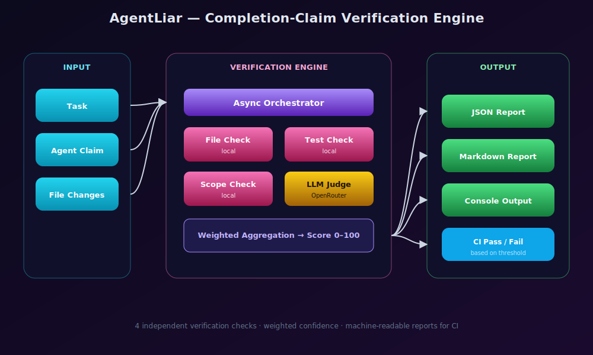

# AgentLiar Detector 🔍

> Made Autonomously Using **NEO** — Your Autonomous AI Engineering Agent
> [https://heyneo.com](https://heyneo.com)

**Production-ready system to detect when coding agents falsely claim task completion.**

AgentLiar performs 4 independent verification checks and returns a confidence score (0-100) with detailed evidence. Use it as a CLI tool, Python library, GitHub Action, or HTTP API.

## 🏗️ Architecture

  

The async orchestrator dispatches four independent checks — file, test, scope (local), plus an optional OpenRouter LLM Judge — and produces a weighted 0–100 confidence score delivered as JSON, Markdown, or console output for CI gating.

## ✨ Features

- **4 Independent Checks**: File, Test, Scope, and LLM Judge
- **Confidence Scoring**: Weighted aggregation (0-100 scale)
- **Multiple Interfaces**: CLI, Python API, GitHub Action, HTTP API
- **Adversarial Detection**: Catches placeholder implementations, empty tests, scope narrowing
- **Structured Reports**: JSON and Markdown output with evidence
- **Production Ready**: Type hints, error handling, logging, async support

## 🚀 Quick Start

### Installation

Install locally with `pip install -e .`, or use `pip install agentliar` once published.

### CLI Usage

Prepare sample inputs from `examples/simple_task.json`, then run `agentliar verify --task-file .tmp/task.txt --claim-file .tmp/claim.json --changes-file .tmp/changes.json --format markdown`. Use `agentliar config` to inspect configuration and `agentliar analyze .tmp/task.txt` to review a task file.

### Python API

Use `Verifier()` from Python code, call `await verifier.verify(...)` with the task description, the claim payload, and the file-change payload, then read the score, pass/fail flag, confidence level, and generated reports.

### GitHub Action

Use the GitHub Action with task, claim, and change files, a confidence threshold, and an optional `OPENROUTER_API_KEY` secret when you want the LLM Judge path enabled.

### HTTP API

Start the API with `python -m agentliar.server` or `uvicorn agentliar.server:app --host 0.0.0.0 --port 8000`, then `POST /verify` with the task, claim, and file-change payloads.

## 🔍 Verification Checks

### 1. File Check
- Detects missing expected files
- Identifies unexpected new files
- Finds placeholder content (TODO, FIXME, pass-only)
- Validates file sizes and content

### 2. Test Check
- Detects empty test bodies
- Identifies tests without assertions
- Finds skipped tests
- Validates claimed vs actual test counts

### 3. Scope Check
- Detects silent scope narrowing ("only", "for now")
- Identifies partial implementations
- Finds TODO markers in code
- Validates requirements coverage

### 4. LLM Judge
- Independent assessment via OpenRouter
- Structured JSON output
- Timeout and retry logic
- Optional (works without API key)

## ⚙️ Configuration

Create a `.env` file:
Set `OPENROUTER_API_KEY` and `OPENROUTER_MODEL` only if you want LLM Judge mode. Recommended judges (May 2026): `anthropic/claude-haiku-4-5` for cheap/fast judging, `anthropic/claude-sonnet-4-6` or `openai/gpt-5.4` for higher-quality judging, `openai/gpt-4.1-mini` for a budget option. The check weights must sum to `1.0`, and `CONFIDENCE_THRESHOLD` controls the pass/fail cutoff.

## 🧪 Testing

Run `pytest` for the full suite, `pytest --cov=agentliar --cov-report=html` for coverage, and target `tests/unit/`, `tests/adversarial/`, or `tests/integration/` for narrower checks. Use `ruff check .`, `ruff format .`, and `mypy src tests` for quality gates.

## 📁 Project Structure

Core layout: `src/agentliar/` contains the checks, orchestration engine, scoring, reports, API, CLI, and server; `tests/` is split into unit, adversarial, and integration coverage; `examples/` holds sample inputs; `action.yml` defines the GitHub Action; and `pyproject.toml` defines packaging and tooling.

## 🎯 Use Cases

- **CI/CD Integration**: Automatically verify PR claims
- **Code Review**: Get independent assessment of task completion
- **Agent Monitoring**: Detect when AI agents overstate progress
- **Quality Gates**: Block merges below confidence threshold
- **Documentation**: Generate verification reports for stakeholders

## 📊 Confidence Score Interpretation

| Score | Level | Meaning |
|-------|-------|---------|
| 90-100 | High | Task appears fully completed |
| 70-89 | Medium | Task likely complete with minor issues |
| 50-69 | Low | Task partially completed |
| 30-49 | Critical | Significant issues detected |
| 0-29 | Failed | Task likely not completed |

## 🔒 Security

- No hardcoded secrets
- API keys via environment variables
- No data persistence
- Local processing (except LLM Judge)

## 🤝 Contributing

1. Fork the repository
2. Create a feature branch
3. Run tests: `pytest`
4. Run linting: `ruff check .`
5. Submit a pull request

## 📄 License

MIT License - see [LICENSE](LICENSE) file.

## 🙏 Acknowledgments

- Built with [Pydantic](https://pydantic.dev/) for configuration
- Uses [Click](https://click.palletsprojects.com/) for CLI
- Uses [FastAPI](https://fastapi.tiangolo.com/) for HTTP API
- Uses [OpenRouter](https://openrouter.ai/) for LLM access

---

**Made with ❤️ to catch those sneaky agent lies!**

## Project Overview

AgentLiar verifies whether an agent completion claim is actually valid by combining file checks, test integrity checks, scope analysis, and optional cross-model judging. It is aimed at teams reviewing AI-generated code changes in CI and local workflows.

## Prerequisites

- Python 3.10+
- `pip`
- Optional: `OPENROUTER_API_KEY` for LLM Judge mode

## API Reference

HTTP endpoint: `POST /verify` on the FastAPI server (`agentliar.server`). Request body includes `task_description`, `claim`, and `file_changes`; response returns score, pass/fail, and evidence blocks.

## Models Used

Optional LLM Judge uses runtime-configured `provider/model` IDs via OpenRouter. Recommended frontier choices (May 2026): `anthropic/claude-opus-4-7`, `anthropic/claude-sonnet-4-6`, `anthropic/claude-haiku-4-5`, `openai/gpt-5.5`, `openai/gpt-5.4`, `google/gemini-3.1-pro`. Core checks run fully local without any external model dependency.
